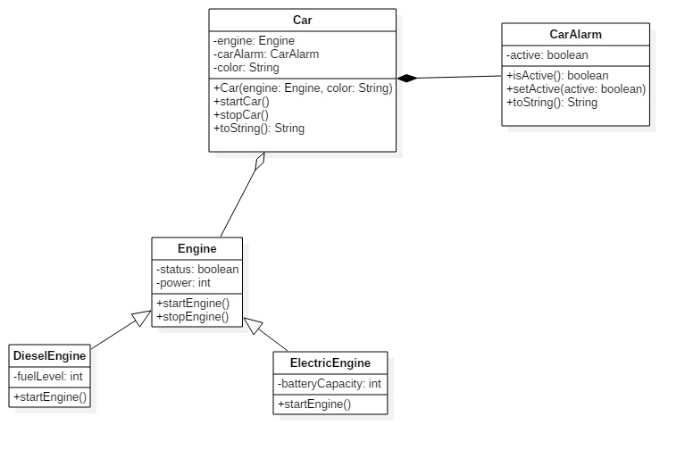
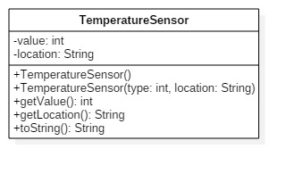
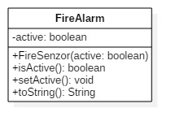
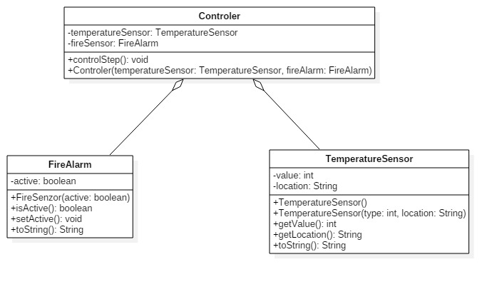
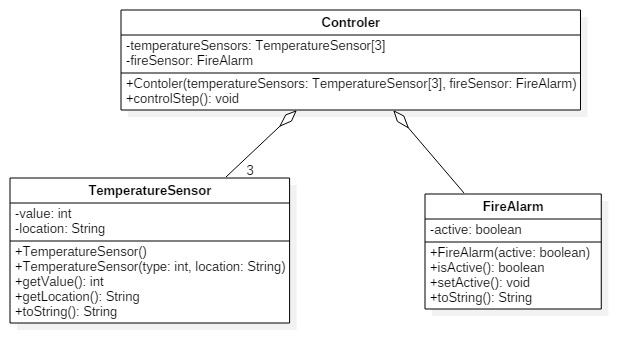
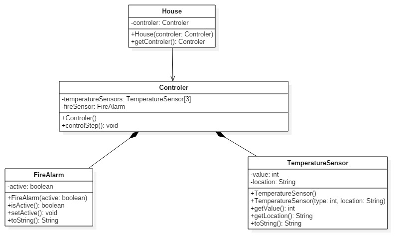
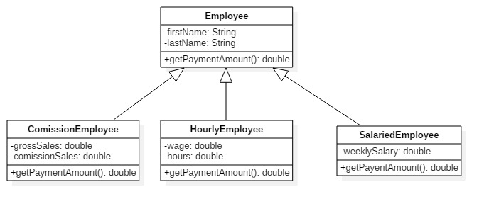

# Implement the following exercises

In this lab you will create small Java applications by using as reference an UML class diagram. Please consider following general notes before start implementing:
- toString() method when required will return a string like *ClassName{attributeName1=attributeValue1,...,attributeNamen=attributeValuen}*.
- Do not reuse (import) the same class in multiple exercises. **Each exercise is standalone and should be resolved in its package.**

## Exercise 0

This exercise demonstrate concepts you will need to apply in this lab. Solution for this diagram can be found in source folder in package *isp.lab4.exercise0*.

**NOTE: This exercise do not require any implementation from student.**

## Exercise 1

Given the UML class diagram above, implement the corresponding Java program.

1. Create Java class based on the diagram above. 
2. Instantiate and test created class in the provided Exercise 1 main method.
3. Create a minimal unit test for testing the behavior of the created class.

## Exercise 2

Given the UML class diagram above, implement the corresponding Java program.

1. Create Java class based on the diagram above. 
2. Instantiate and test created class in the provided Exercise 2 main method.
3. Create a minimal unit test for testing the behavior of the created class.

## Exercise 3 

Given the UML class diagram above, implement the corresponding Java program.

1. Create Java classes based on the diagram above. 
    * controlStep() method check temperature and if temperature is > 50 will set fireAlarm sensor *true*.
    * controlStep() method print a message "Fire alarm started" or "Fire alarm not started" based on verification results.
2. Instantiate and test created classes in the provided Exercise 3 main method.
3. Create a minimal unit test for testing the behavior of the created class.

## Exercise 4

Given the UML class diagram above, implement the corresponding Java program.

1. Create Java classes based on the diagram above. 
    * controlStep() method check temperature and if temperature is > 50 for **all sensors** will set fireAlarm sensor *true*.
    * controlStep() method print a message "Fire alarm started" or "Fire alarm not started" based on verification results.
2. Instantiate and test created classes in the provided Exercise 4 main method.
3. Create a minimal unit test for testing the behavior of the created class.

## Exercise 5 

Given the UML class diagram above, implement the corresponding Java program.

1. Create Java classes based on the diagram above. 
    * controlStep() method check temperature and if temperature is > 50 for **at least one sensor** will set fireAlarm sensor *true*.
    * controlStep() method print a message "Fire alarm started" or "Fire alarm not started" based on verification results.
2. Instantiate and test created classes in the provided Exercise 5 main method.
    * call controlStep() method in main by accessing the controller trough *House* object.
3. Create a minimal unit test for testing the behavior of the created class.

## Exercise 6 

Given the UML class diagram above, implement the corresponding Java program.

Note: Constructors are not represented in the diagram above, but you will need to add all necessary constructors to be able to initialise all attributes. 

1. Create Java classes based on the diagram above. 
    * method getPaymentAmount() will return 0.0 in base class Employee.
2. Instantiate and test created classes in the provided Exercise 6 main method. 
    1. create 1 object of each derived type and display payment amount.
    2. create a vector of 6 objects of type Employee, add 2 object of each type and calculate total payment.
3. Create a minimal unit test for testing the behavior of the created class.

