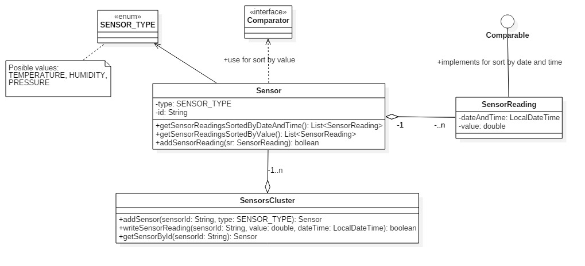

# Implement the following exercises

## Exercise 1

Provide implementation for IReadingRepository interface in an additional SensorReadingList class. Follow description (method comments) from interface to identify exact behaviour needed.

## Exercise 2

Review classes Equipment and EquipmentController from package 'isp.lab6.exercise2'. Provide implementation for methods so that all tests from EquipmentControllerTest and EquipmentTest classes will pass.

## Exercise 3


Given the UML class diagram above, implement the corresponding Java program.

1. Create Java class based on the diagram above. 
    * _SensorReading_ should should implement ```Comparable<SensorReading>``` for comparing by date and time
    * _Sensor_ should use ```Comparator<SensorReading>``` for comparing _SensorReading_ by value
2. Demonstrate the functionality of application in Exercise1 class main method.
    * Use _SensorsCluster.addSensor_ to add few sensors. NOTE: The method should return an instance to the newly created Sensor object or null if a sensor with given id already exists
    * Use _SensorsCluster.writeSensorReading_ to add some readings for previously added sensors. This method should search for sensor by sensorId and use the sensor addSensorReading() to add a new value. Method will return false if sensor cannot be found
    * Use _SensorsCluster.getSensorById_ to obtain a reference for a previously added sensor and display sorted readings by the 2 provided criterias
3. Create minimal unit tests for testing the behavior of the program.

**Note 1: Constructors and setter\getter methods are not represented in the diagram but can\should be implemented."**

**Note 2: You can add any extra methods if required.**


## Exercise 4

Create a new version of ATM exercise from Laboratory 5 and use ArrayList instead of simple arrays[] for storing accounts in Bank class.
