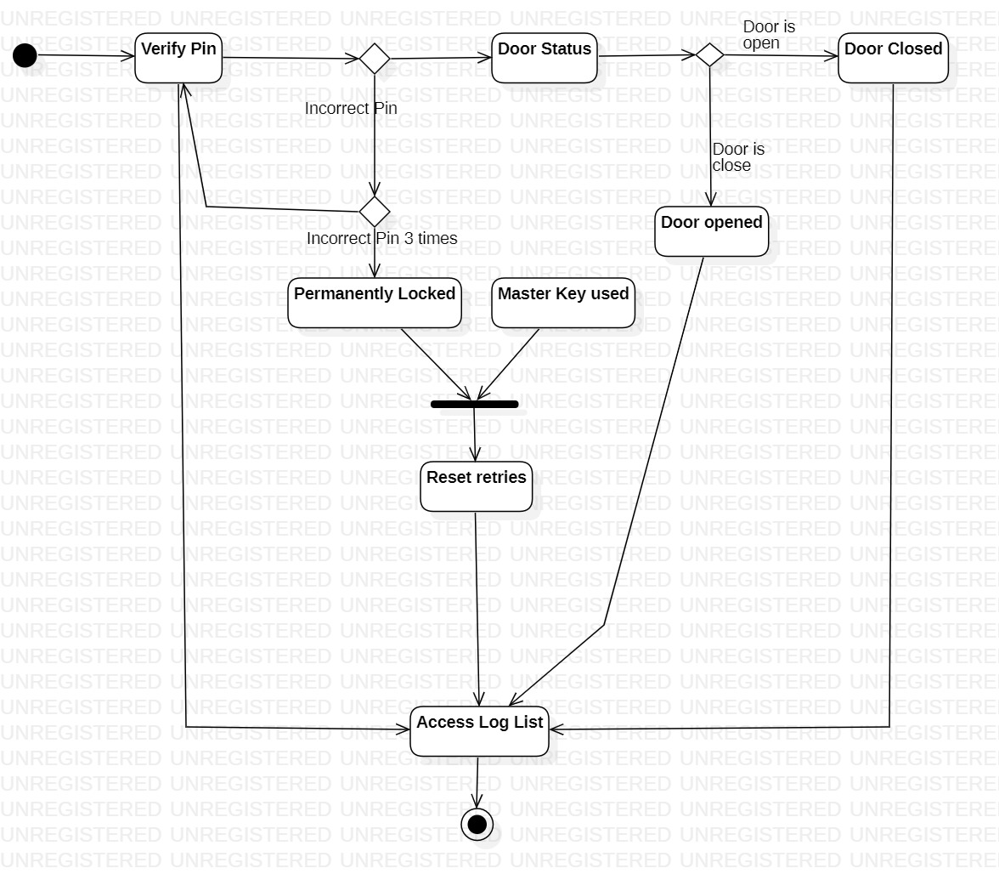
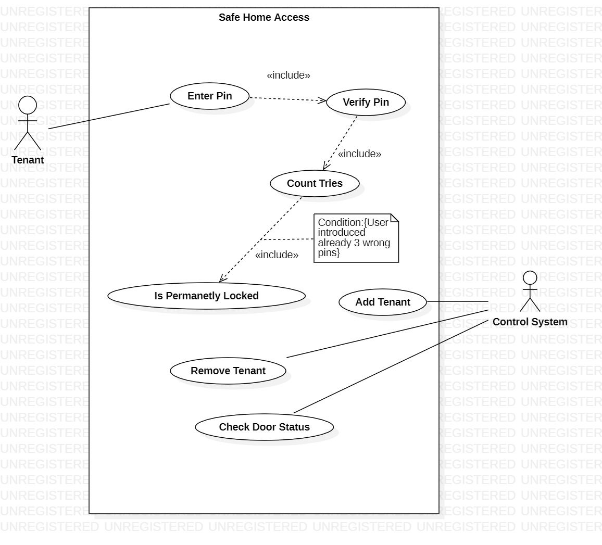

# Lab 7 - Safe Home Access

## Exercise 1 - Java implementation

Implement a safe home access Java application based on the diagram above. Consider also following functional requirements in implementing your program:
1. If pin is wrong _enterPin_ method shall throw an _InvalidPinException_.
2. If 3 consecutive attempts are made to enter pin then door is locked(until master key pin is used) and _enterPin_ method shall throw TooManyAttemptsException. Any further invocations of _enterPin_ method will throw TooManyAttemptsException.
3. If master key pin is used, door will be unlocked and retries count will be reset to 0. 
4. If pin is correct, door shall be opened or closed depending on current state (if open will be closed, if closed will be opened)
5. When tenant already exists by name, _addTenant_ method will throw TenantAlreadyExistsException.
6. When tenant not found, _removeTenant_ method will throw TenantNotFoundException. 
7. All attempts (successful or not) will be logged in access log list.
8. Simulate all operations in _main_ from _SafeHome_.

**NOTE - Java project come with prefiled unit tests. You should make sure all tests pass. You are not allowed to change unit tests (except initialisation of Controller object in the _instantiateDoorController()_ method**).

## Exercise 2 - State machine diagram

For Safe Home Access application create _UML state machine_ diagram.  

## Exercise 3 - Use case diagram

For Safe Home Access application create _UML use case_ diagram.

