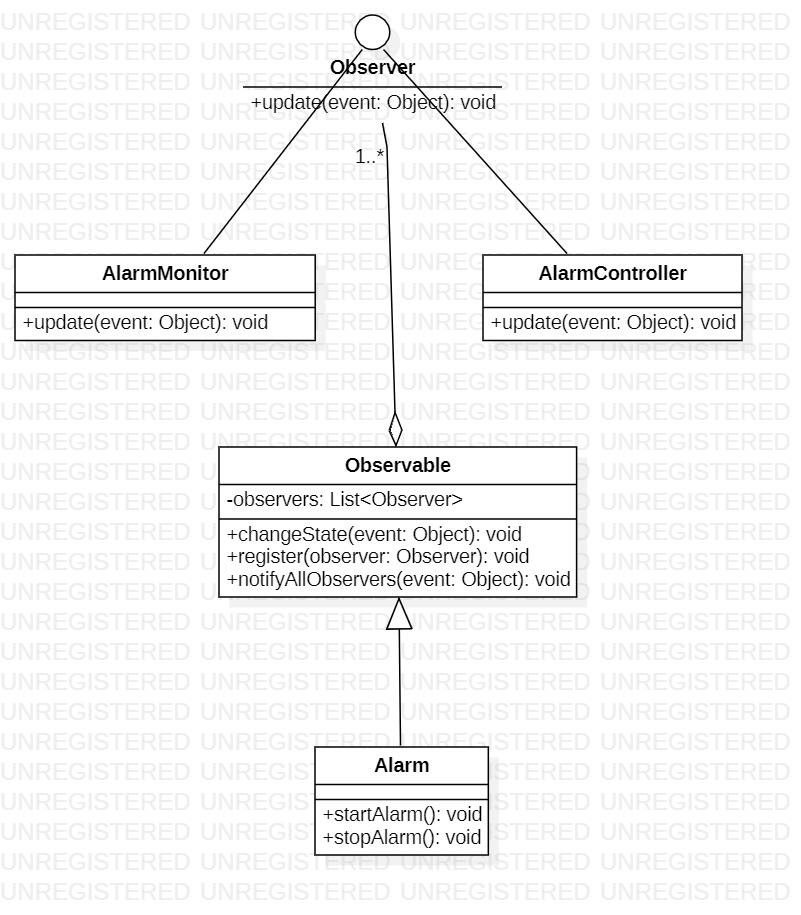
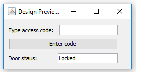

# Lab 9

## Exercise 1 

In listing bellow is presented a basic implementation of Observer design pattern. 

```java
import java.util.ArrayList;
import java.util.List;
 
class Observable {
 
   private List<Observer> observers = new ArrayList<Observer>();
 
   public void changeState(Object event) {
      notifyAllObservers(event);
   }
 
   public void register(Observer observer) {
      observers.add(observer);		
   }
 
   private void notifyAllObservers(Object event) {
      for (Observer observer : observers) {
         observer.update(event);
      }
   } 	
}
 
interface Observer {
   public abstract void update(Object event);
}
 
//usage example
 
class Alarm extends Observable {
    void startAlarm() {
        System.out.println("Alarm has been started!");
        this.changeState("START");
    }
 
    void stopAlarm() {
        System.out.print("Alarm has been stopped!");
        this.changeState("STOP");
    }
}
 
class AlarmMonitor implements Observer {
 
    @Override
    public void update(Object event) {
        System.out.println("Alarm status has changed!");
        System.out.println("Received event: Event class:"+event.getClass()+":"+event.toString());
 
    }
 
}
 
 
public class Client {
    public static void main(String[] args) throws InterruptedException{
        Alarm fireAlarm = new Alarm();
        AlarmMonitor monitor = new AlarmMonitor();
        fireAlarm.register(monitor);
 
        fireAlarm.startAlarm();
        Thread.sleep(500);
        fireAlarm.stopAlarm();
 
    }
}
```

1. Add  in exercise1 package classes from listing above and execute the code. Notice the mechanism used to send notifications to AlarmMonitor each time Alarm object change it's state. 
2. Create a class AlarmController and register an object of this type as observer for the Alarm object. Each time controller is notified will print messaje "Sending SMS message to owner."
3. Create UML class diagram of the program.  


## Exercise 2
A system is composed of 1 controller and 3 sensor types (TEMPERATURE, HUMIDITY, PRESSURE). Each sensor has a `void readSensor()` method which, when executed will randomly generate a value. 
Controller is registered as observer for the 3 sensors. Each time a sensor change it's value controller is notified and will print sensor value and sensor type.  

1. Implement a Java program based on the above description.
2. Test the functionality in `main()` method. From main readValue() method will be called for each sensor to test Observer pattern is working.

**Note** you should use Observer design pattern  

## Exercise 3

Add a user interface similar with the one in diagram bellow for `Safe Home Access` application from Lab 8.



## Exercise 4 (Optional)

Study MVC design pattern and how this can be implemented in Java. Here are some links presenting how MVC pattern can be implemented:
- https://medium.com/@ssaurel/learn-to-make-a-mvc-application-with-swing-and-java-8-3cd24cf7cb10 
- https://examples.javacodegeeks.com/core-java/java-swing-mvc-example/ 

Use MVC pattern to add a user interface to program in exercise 2 where will be a button and a text field for each sensor type. When button is pressed value of the sensor is displayed in the text field.
